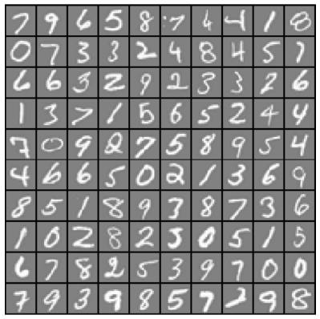
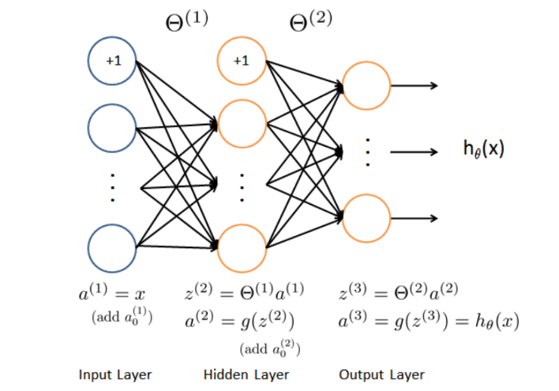
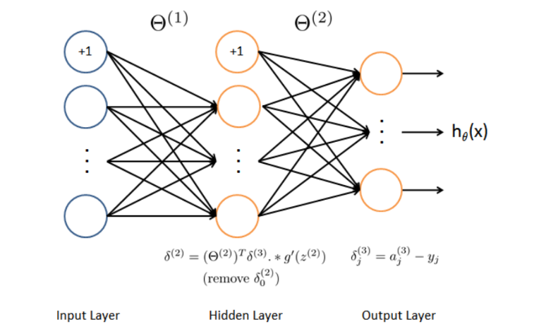

# Neural_Network_HandWriteDigits
implement the backpropagation algorithm for neural networks and apply it to the task of hand-written digit recognition.

## Visualizing the data
here is the part of the dataset that we use to train our model

## Model representation
that's the neural network model that we use to train our data.
* an input layer
* a hidden layer
* an output layer

## Backpropagation
backpropagation is the most important part where we calculate the Theta in the model.

after we have successfully implemented the neural network model, we can check the accuracy of our model.

enjoy it!!!
:octocat:
